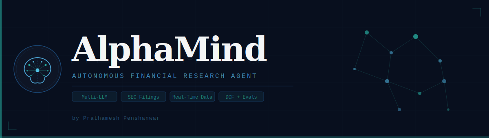
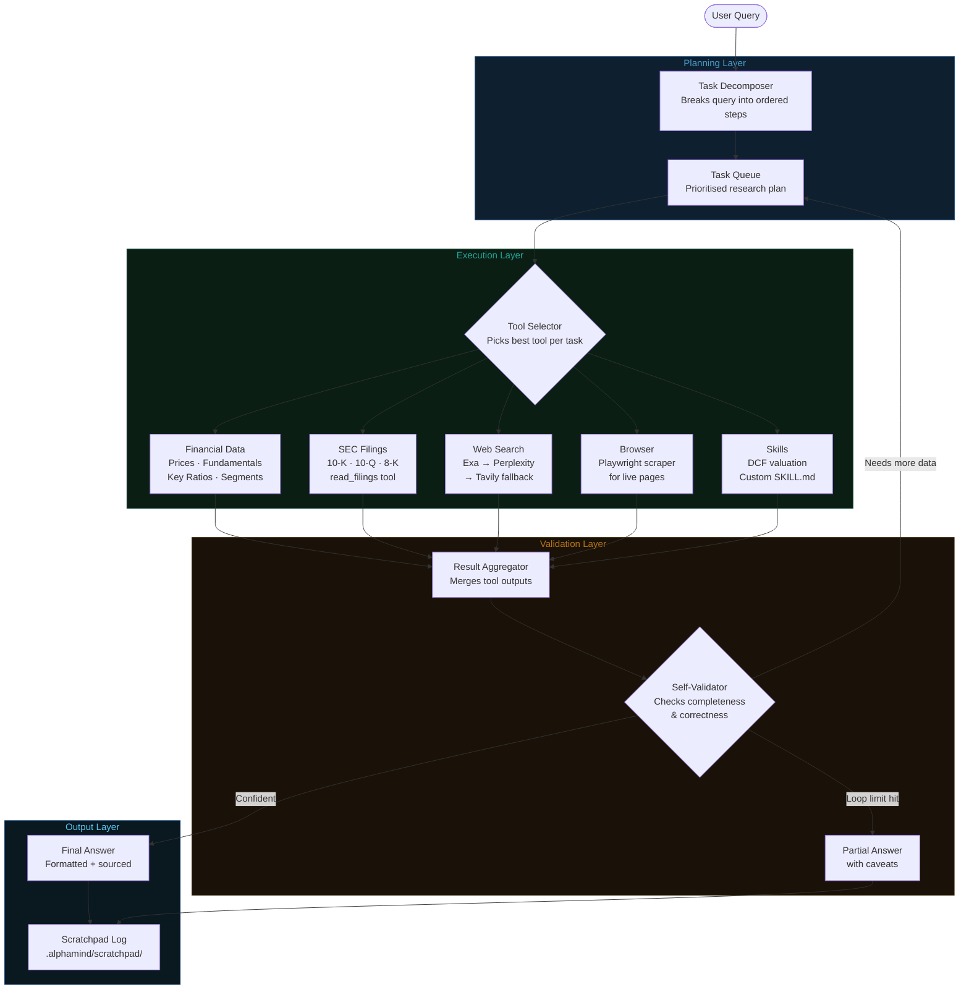

<div align="center">



<br/>

[](https://www.typescriptlang.org/)
[](https://bun.sh)
[](https://langchain.com)
[](LICENSE)
[](https://github.com/prathamesh-penshanwar/AlphaMind/actions)

*AlphaMind takes complex financial questions and turns them into clear, step-by-step research plans — running those tasks with live market data, validating its own work, and delivering data-backed answers.*

</div>

---

## Table of Contents

- [Overview](#-overview)
- [Agent Architecture & Flow](#-agent-architecture--flow)
- [Key Features](#-key-features)
- [Project Structure](#-project-structure)
- [Prerequisites](#-prerequisites)
- [Installation](#-installation)
- [Configuration](#-configuration)
- [Usage](#-usage)
- [Evaluation](#-evaluation)
- [Debugging](#-debugging)
- [Adding Custom Skills](#-adding-custom-skills)
- [Contributing](#-contributing)
- [Security](#-security)
- [License](#-license)

---

## Overview

AlphaMind is a CLI-based autonomous agent built for serious financial research. It decomposes complex queries into structured research plans, autonomously selects the right tools, fetches real-time market data, and self-validates its reasoning before surfacing results.

Think of it as a research analyst that never sleeps — equipped with access to income statements, balance sheets, SEC filings, crypto prices, insider trades, and the broader web.

---

## Agent Architecture & Flow

AlphaMind operates as a multi-step autonomous loop. Every user query passes through a structured pipeline of planning, execution, validation, and delivery.



### How the loop works

1. **Query in** — the user types a financial question in the CLI
2. **Decompose** — the Task Decomposer breaks it into specific, ordered research steps (e.g. *fetch revenue*, *fetch P/E ratio*, *search recent news*)
3. **Queue** — tasks are pushed into a prioritised queue; dependent tasks wait for their prerequisites
4. **Select & Execute** — for each task, the Tool Selector picks the best tool (or combination) and runs it
5. **Aggregate** — raw outputs from all tool calls are merged into a unified context
6. **Validate** — the Self-Validator checks whether the answer is complete and internally consistent
   - If not → loops back to the queue with a refined sub-task
   - If a step limit is hit → surfaces a partial answer with explicit caveats
   - If confident → proceeds to output
7. **Answer out** — the final answer is formatted in the CLI; everything is written to the scratchpad for later inspection

---

## Key Features

| Feature | Description |
|---|---|
| 🧩 **Intelligent Task Planning** | Automatically decomposes complex queries into structured, ordered research steps |
| 🤖 **Autonomous Execution** | Selects and runs the right tools to gather relevant financial data |
| 🔁 **Self-Validation** | Checks its own work and iterates until tasks are confidently complete |
| 📈 **Real-Time Financial Data** | Income statements, balance sheets, cash flows, key ratios, and more |
| 🌐 **Web Research** | Integrated web search (Exa → Perplexity → Tavily fallback chain) |
| 🗂️ **SEC Filing Reader** | Reads 10-K, 10-Q, and 8-K documents directly |
| 🔐 **Safety Guardrails** | Built-in loop detection and step limits to prevent runaway execution |
| 🧬 **Multi-Provider LLM** | Supports OpenAI, Anthropic, Google, xAI, OpenRouter, and local Ollama |
| 📐 **Extensible Skills** | Add custom SKILL.md workflows (e.g., DCF valuation) without touching core code |
| 📊 **Evaluation Suite** | LangSmith-powered eval runner with real-time Ink UI |

---

## Project Structure

```
AlphaMind/
├── assets/
│   ├── logo.svg            # Project logo
│   └── banner.svg          # Project banner
├── src/
│   ├── agent/              # Core agent loop, prompts, scratchpad, token tracking
│   ├── cli.tsx             # Ink/React interactive CLI interface
│   ├── index.tsx           # Entry point
│   ├── headless.ts         # Non-interactive mode for scripting/CI
│   ├── components/         # Ink UI components (input, history, model selector)
│   ├── hooks/              # React hooks (agent runner, model selection, input history)
│   ├── model/              # Multi-provider LLM abstraction layer
│   ├── tools/
│   │   ├── finance/        # Prices, fundamentals, filings, insider trades, key ratios
│   │   ├── search/         # Exa, Perplexity, Tavily search integrations
│   │   ├── browser/        # Playwright-based web scraping
│   │   ├── fetch/          # Generic web fetch tool
│   │   ├── openbb/         # OpenBB Platform bridge
│   │   └── descriptions/   # Rich tool descriptions for LLM system prompt
│   ├── skills/             # Extensible SKILL.md-based workflows (DCF, etc.)
│   ├── evals/              # LangSmith evaluation runner + Ink UI
│   └── utils/              # Env, config, caching, token estimation, markdown
├── scripts/
│   └── release.sh          # Automated release script
├── .github/
│   └── workflows/ci.yml    # CI: typecheck + tests on every push/PR
├── .alphamind/             # Runtime data (gitignored): cache, scratchpad, settings
├── env.example             # Template for environment variables
├── requirements.txt        # Python deps (OpenBB Platform)
└── tsconfig.json
```

---

## Prerequisites

- [**Bun**](https://bun.sh) runtime v1.0 or higher
- At least one **LLM API key** (OpenAI recommended as default)
- **Financial Datasets API key** for market data (AAPL, NVDA, MSFT are free)
- *(Optional)* Exa/Tavily API key for web search

### Installing Bun

**macOS / Linux:**
```bash
curl -fsSL https://bun.sh/install | bash
```

**Windows:**
```powershell
powershell -c "irm bun.sh/install.ps1|iex"
```

Verify installation:
```bash
bun --version
```

---

## Installation

```bash
# 1. Clone the repository
git clone https://github.com/PRATHAM777P/AlphaMind.git
cd AlphaMind

# 2. Install dependencies
bun install
```

---

## Configuration

Copy the environment template and fill in your keys:

```bash
cp env.example .env
```

Edit `.env`:

```env
# LLM Providers (at least one required)
OPENAI_API_KEY=your-openai-api-key
ANTHROPIC_API_KEY=your-anthropic-api-key
GOOGLE_API_KEY=your-google-api-key
XAI_API_KEY=your-xai-api-key
OPENROUTER_API_KEY=your-openrouter-api-key

# Local LLM (Ollama)
OLLAMA_BASE_URL=http://127.0.0.1:11434

# Financial Data
FINANCIAL_DATASETS_API_KEY=your-api-key

# Web Search (Exa → Perplexity → Tavily fallback)
EXASEARCH_API_KEY=your-exa-api-key
PERPLEXITY_API_KEY=your-perplexity-api-key
TAVILY_API_KEY=your-tavily-api-key

# OpenBB Platform (optional, local REST API)
OPENBB_API_URL=http://localhost:8700

# LangSmith (optional, for eval tracking)
LANGSMITH_API_KEY=your-langsmith-api-key
LANGSMITH_ENDPOINT=https://api.smith.langchain.com
LANGSMITH_PROJECT=alphamind
LANGSMITH_TRACING=true
```

> **Never commit your `.env` file.** It is gitignored by default.

---

## Usage

**Interactive mode (recommended):**
```bash
bun start
```

**Development mode (auto-reload on file changes):**
```bash
bun dev
```

**Switch model/provider** — inside the CLI, type:
```
/model
```

This opens an interactive model selector supporting OpenAI, Anthropic, Google, xAI, OpenRouter, and Ollama.

**Example queries:**
```
> What is Apple's current P/E ratio compared to the sector average?
> Summarize Microsoft's latest 10-K filing risk factors
> Show me the top 5 insider buys in the S&P 500 this month
> Run a DCF valuation for Tesla using the last 5 years of cash flows
```

---

## Evaluation

AlphaMind ships with a built-in evaluation suite using LangSmith for tracking and an LLM-as-judge scoring approach.

```bash
# Run on all questions
bun run src/evals/run.ts

# Run on a random sample
bun run src/evals/run.ts --sample 10
```

The eval runner displays a real-time Ink UI showing progress, current question, and running accuracy. Results are automatically logged to LangSmith.

---

## Debugging

AlphaMind logs all agent activity to a scratchpad for debugging and history replay.

**Scratchpad location:** `.alphamind/scratchpad/`

```
.alphamind/scratchpad/
├── 2026-04-25-091400_9a8f10723f79.jsonl
└── 2026-04-25-143022_a1b2c3d4e5f6.jsonl
```

Each JSONL file tracks `init` (original query), `tool_result` (tool calls + outputs), and `thinking` (agent reasoning steps).

---

## Adding Custom Skills

Drop a `SKILL.md` file into:

- **Project-level:** `.alphamind/skills/` — skills specific to this repo
- **User-level:** `~/.alphamind/skills/` — available across all projects

See `src/skills/dcf/SKILL.md` for a working example (DCF valuation workflow).

---

## Contributing

Contributions are welcome! See [CONTRIBUTING.md](CONTRIBUTING.md) for the full guide.

1. Fork → branch → commit → push → open PR
2. Keep PRs small and focused — one feature or fix per PR
3. Ensure `bun run typecheck` and `bun test` pass before submitting

---

## Security

Please report vulnerabilities **privately** — do not open public issues for security bugs.
See [SECURITY.md](SECURITY.md) for the full responsible disclosure policy.

---

## License

This project is licensed under the [MIT License](LICENSE).

---

<div align="center">


<br/>

Built by **Prathamesh Penshanwar**

</div>
